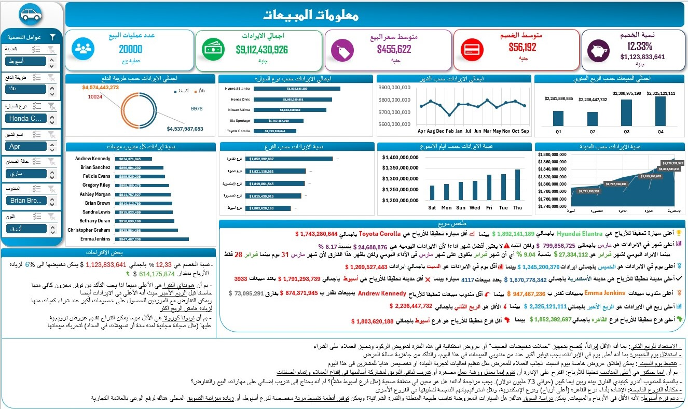

# 📊 Sales Performance Dashboard (Excel)

An interactive and dynamic Sales Dashboard built entirely using **Microsoft Excel**. This project demonstrates strong data analysis, visualization, and business intelligence skills.

## 📸 Dashboard Preview

*(You can also watch a short video demo here: [Dashboard Video](carsProjectAnalysisVideo.mp4))*

## 🎯 Project Objective
The goal of this project is to analyze sales data for a company to provide actionable insights into revenue, discounts, top-performing products, and sales representatives.

## 🛠️ Tools & Techniques Used
*   **Microsoft Excel:** Pivot Tables, Pivot Charts, Slicers, Timelines.
*   **Data Cleaning:** Power Query (or manual cleaning).
*   **Advanced Formulas:** XLOOKUP, SUMIFS, INDEX/MATCH.
*   **UI/UX Design:** Custom formatting, dynamic KPI cards, and interactive filtering.

## 📈 Key Insights (KPIs)
Based on the dashboard analysis, the following insights were extracted:
*   **Total Sales:** $9,112,430,926
*   **Total Discount:** $1,123,833,641 (12.33%)
*   **Top Product:** Honda C (with total revenue of $4,537,987,653)
*   **Top Sales Rep:** Andrew Kennedy (with total sales of $1,874,767,815)
*   **Highest Revenue Month:** April (with $1,743,280,644)
*   **Sales Trend:** Q4 shows the highest sales among all quarters.

## 💡 Business Recommendations (Based on the Report)
*   **Discount Strategy:** The current discount rate (12.33%) is eating into profits. It is recommended to reduce discounts by 6% to increase profitability.
*   **Inventory Management:** Focus on increasing the stock of top-performing models (Honda C, Hyundai Elantra) while reassessing the stock of low-performing models.
*   **Sales Force Optimization:** Provide additional training and incentives to top performers (like Andrew Kennedy) and investigate the reasons behind low performance in certain regions.
*   **Seasonal Planning:** Since April and Q4 show peak sales, marketing campaigns and inventory should be ramped up during these periods.

## 🚀 How to Use
1. Download the `Sales_Dashboard.xlsx` file.
2. Open it in Microsoft Excel (2016 or later is recommended).
3. Use the **Slicers** (City, Product, Sales Rep) on the left panel to interact with the data and filter the dashboard dynamically.

## 👨‍💻 Author
**[Your Name]**
*   LinkedIn: [www.linkedin.com/in/mostafa-moham-ed]
*   Email: [mostafa.kayed100@gmail.com]
